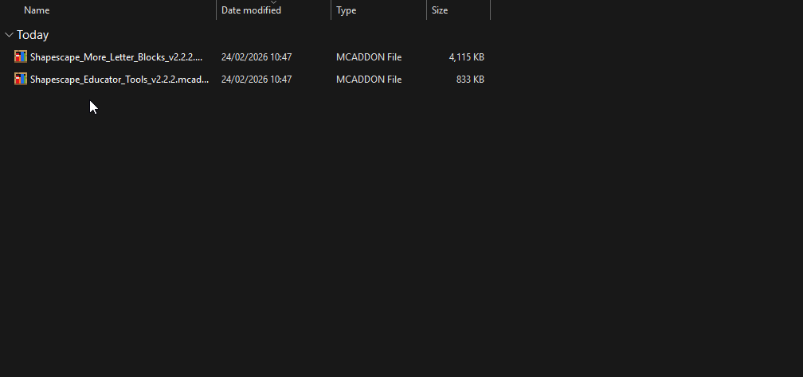

# 🚀 Quick Start Guide

Welcome to Educator Tools! This guide will help you get started in just a few minutes.

## Table of Contents

- [What is Educator Tools?](#what-is-educator-tools)
- [Install in 3 Steps](#install-in-3-steps)
- [Your First 5 Minutes](#your-first-5-minutes)
- [Success! You're Ready to Teach](#-success-youre-ready-to-teach)
- [Tips for New Teachers](#tips-for-new-teachers)

---

## What is Educator Tools?

Educator Tools is a collection of classroom management features for Minecraft Education that helps teachers control their virtual classroom. Think of it as your digital teaching assistant - it lets you move students, change game settings, create activities, and keep everyone focused on learning.

!!! tip
    **New to Minecraft Education?** Don't worry! This guide assumes no prior experience. We'll walk you through everything step by step.

---

## Install in 3 Steps

### Step 1: Download the Pack

Go to the [Downloads page](https://github.com/ShapescapeMC/Educator-Tools/releases) and download the latest version of Educator Tools.

### Step 2: Import into Minecraft

Open Minecraft Education, go to **Settings → Storage → Import**, and select the downloaded pack.

### Step 3: Create or Open a World

When creating a new world or editing an existing one, activate the Educator Tools pack in the **Behavior Packs** section.

!!! note
    **How to verify it's working:** Join the world and look for the **Educator Toolbox** item in your hotbar (the bottom row of your inventory). If you see it, you're all set!

Need more detailed installation help? See the full **[Installation Guide](Installation.md)**.

---

## Your First 5 Minutes

Once you're in the world with Educator Tools active, try these basic actions to get familiar with the tools:

### 1. Open the Educator Toolbox ⏱️ 30 seconds

**How:** Right-click the Educator Toolbox item in your hotbar

**What you'll see:** A menu with all the classroom tools

!!! tip
    **Quick Access Tip:** Keep the Educator Toolbox in slot 1 of your hotbar. Press the `1` key anytime to quickly select it.

---

### 2. Move a Student ⏱️ 1 minute

**When to use it:** A student is lost or you want to gather everyone together

**How to do it:**
1. Click **Teleport** in the toolbox menu
2. Pick the student you want to move
3. Choose where to send them:
   - **To you** (most common)
   - **To another student**

!!! info
    You need at least 2 players online (you + one student) for teleport to work.

---

### 3. Get Everyone's Attention ⏱️ 1 minute

**When to use it:** You need students to stop and listen

**How to do it:**
1. Click **Focus Mode** in the toolbox menu
2. Select the students you want to focus (or choose "All Students")
3. Type a message (like "Please look at the board")
4. Turn Focus Mode **ON**

**What happens:** Students' screens will dim and show your message. They can't move or break blocks until you turn Focus Mode off.

!!! warning
    **Remember to turn it off!** Click **Disable Globally** in the Focus Mode menu when you're done giving instructions.

---

### 4. Heal and Feed Students ⏱️ 30 seconds

**When to use it:** Students are running low on health or hunger

**How to do it:**
1. Click **Manage Health** in the toolbox menu
2. Select the student or team
3. Click **Heal** to restore their health and hunger

---

### 5. Change Time or Weather ⏱️ 30 seconds

**When to use it:** You want it to be daytime or stop the rain

**How to do it:**
1. Click **World Management** in the toolbox menu
2. Click **Environment**
3. Choose Daytime or Weather settings
4. Choose your preferred time or weather:
   - **Time:** Day, Noon, Night, Midnight
   - **Weather:** Clear, Rain, Thunder

!!! tip
    **Pro Tip:** Use **Always Day** to lock the time at noon. This ensures consistent lighting throughout your lesson!

---

## ✅ Success! You're Ready to Teach

You now know the basics! Here's what to explore next:

### For Everyday Teaching
- 🎯 **[Essential Tools](Essential-Tools.md)** - The 5 most important tools (Custom Nicknames, Assignments, Focus Mode, Lock Players, Letter Blocks)

### When You Need More
- 👥 **[Student Management Tools](Student-Management-Tools.md)** - Teleport, gamemode, teams, and inventory
- 🎓 **[Classroom Control Tools](Classroom-Control-Tools.md)** - Focus mode, timer, assignments, and more
- 🌍 **[World Management Tools](World-Management-Tools.md)** - Time, weather, game rules
- 🔤 **[Letter Blocks Guide](Letter-Blocks-Getting-Started.md)** - Build words and equations with special blocks

### If You Need Help
- ❓ **[FAQ and Troubleshooting](FAQ-and-Troubleshooting.md)** - Common questions and solutions
- 🆘 **[Getting Help](Getting-Help.md)** - How to report problems or ask questions

---

## Tips for New Teachers

!!! tip
    **Start with 2-3 tools** - Don't try to learn everything at once. Master Custom Nicknames and Focus Mode first, then gradually explore other features.

!!! note
    **Practice in an empty world** - Create a test world to try out the tools before using them with students. This helps you feel confident during actual lessons.

!!! info
    **The toolbox is always with you** - If you somehow lose it, you can get it back from the Creative Mode inventory (search for "Educator Toolbox").

**You can't break anything!** All settings can be changed, Focus Mode can be turned off anytime, and player locks can be removed. Experiment freely and discover what works best for your teaching style!

---

**Next Steps:**

- 📚 **Learn the essentials:** [Essential Tools](Essential-Tools.md) - Master the 5 most important features
- 📖 **See everything:** [All Features Guide](Educator-Toolbox.md) - Complete tool reference
- 🏠 **Return home:** [Wiki Home](index.md) - Main navigation page
